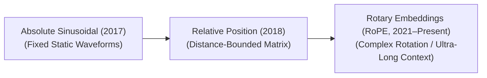

  
    
   

# Awesome Positional Encoding 🚀
## Positional Encoding: Evolution, Variants, Types, & Applications 🧬

> 🌟 **A curated list of awesome positional encoding techniques, research papers, architectures, and applications in modern Transformers and Large Language Models (LLMs).**

Positional Encoding is a foundational component of the Transformer architecture. Because the core Self-Attention mechanism processes all tokens in a sequence simultaneously and in parallel, it is inherently permutation-invariant. Without positional information, a Transformer treats the sentence `"Dog bites man"` exactly the same as `"Man bites dog"`. Positional Encoding injects spatial coordinate data into the token embeddings, allowing the network to understand word order, structural distances, and sequence geometry.

---

## 1. The Chronological Evolution ⏳

The architectural progression of positional tracking reflects a shift from rigid, hardcoded coordinate curves to learnable spaces, moving toward modern relative, complex-plane rotations.

| Era | Concept | Limitation / Significance | Year First Used | Paper Link |
|---|---|---|---|---|
| [**The Absolute Static Era**](pages/absolute_static_era.md) | The foundation. Used fixed, deterministic sine and cosine functions of varying frequencies to generate unique coordinate vectors that are directly added to the input token embeddings. | *Limitation:* Rigid and unable to extrapolate gracefully to sequence lengths longer than the maximum window defined during training. | 2017 | [Attention Is All You Need (Vaswani et al., 2017)](https://arxiv.org/abs/1706.03762) |
| [**The Relative Distance Era**](pages/relative_distance_era.md) | Shifted focus from absolute indices to the *relative distance* between pairs of tokens ($i - j$). It models relative offsets as trainable bias tensors inside the attention calculation matrix. | *Limitation:* Introduces significant memory overhead by creating large distance lookup tables, which slows down high-throughput inference tracking. | 2018 | [Self-Attention with Relative Position Representations (Shaw et al., 2018)](https://arxiv.org/abs/1803.02155) |
| [**The Rotary & Multi-Scale Era**](pages/rotary_multiscale_era.md) | Formally established by **Rotary Position Embedding (RoPE)**. Instead of adding positional data, it multiplies the Query and Key vectors by a rotation matrix, encoding relative distance as a geometric angle in a complex plane. | *Significance:* The standard default configuration for modern LLMs (e.g., Llama, Mistral). It naturally supports context window extrapolation via dynamic scaling methods. | 2021 | [RoFormer: Enhanced Transformer with Rotary Position Embedding (Su et al., 2021)](https://arxiv.org/abs/2104.09864) |

---

## 2. Core Functional & Architectural Variants 🏗️

Positional tracking approaches are strictly split based on whether coordinates are absolute values assigned at data entry or relative values evaluated inside attention operations.

| Variant | Mechanism | Types / Significance | Year First Used | Paper Link |
|---|---|---|---|---|
| [**Absolute Positional Encoding**](pages/absolute_positional_encoding.md) | Assigns a unique, standalone position vector to each absolute index (e.g., token at index `0`, token at index `1`) before the data reaches the self-attention blocks. | *Types:* Deterministic (Sinusoidal) or Learned (Parametric embedding matrices initialized randomly and trained via backpropagation). | 2017 | [Attention Is All You Need (Vaswani et al., 2017)](https://arxiv.org/abs/1706.03762) |
| [**Relative Positional Encoding**](pages/relative_positional_encoding.md) | Drops absolute token coordinates entirely. It computes position values purely during the attention phase by measuring how far apart tokens sit relative to each other. | *Significance:* Highly intuitive for natural language, where the structural distance between a pronoun and its noun matters more than their absolute index positions in a document. | 2018 | [Self-Attention with Relative Position Representations (Shaw et al., 2018)](https://arxiv.org/abs/1803.02155) |

---

## 3. Advanced Context Window Extrapolation Types 🔍

As frontier applications require processing ultra-long contexts (e.g., full books or code repositories), specialized RoPE extensions modify the underlying rotational frequencies at inference time.

| Extrapolation Type | Mechanism | Pros / Cons / Status | Year First Used | Paper Link |
|---|---|---|---|---|
| [**Linear RoPE Scaling**](pages/linear_rope_scaling.md) | Directly divides the incoming position indices by a constant scaling factor ($S$) to fit a long sequence into the original trained context boundaries. | *Cons:* Smoothly compresses all token distances, which damages the model's high-frequency local resolution and degrades close-range attention accuracy. | 2023 | [Extending Context Window of Large Language Models via Positional Interpolation (Chen et al., 2023)](https://arxiv.org/abs/2306.15595) |
| [**NTK-Aware Scaling (Neural Tangent Kernel)**](pages/ntk_aware_scaling.md) | Scales the base frequency of the coordinate rotation instead of scaling the position indices uniformly. It prevents high-frequency details from collapsing while expanding low-frequency ranges. | *Pros:* Allows models to extrapolate context lengths out by $4\times$ to $10\times$ at inference time with minimal perplexity degradation and zero retraining. | 2023 | [NTK-Aware Scaled RoPE (bloc97, 2023)](https://www.reddit.com/r/LocalLLaMA/comments/14lz7j5/ntkaware_scaled_rope_allows_llama_models_to_have/) |
| [**YaRN (Yet another RoPE extensioN)**](pages/yarn.md) | An advanced variation that applies a multi-scale frequency sweep, separating out close-range token structures from long-range context dependencies. | *Status:* Enables modern models to reliably process context windows exceeding 128k to 1M+ tokens without losing fine-grained accuracy. | 2023 | [YaRN: Efficient Context Window Extension of LLMs (Peng et al., 2023)](https://arxiv.org/abs/2309.00071) |
| [**ALiBi (Attention with Linear Biases)**](pages/alibi.md) | Drops positional embeddings entirely. Instead, it injects a static, non-learnable negative bias penalty directly into the attention matrix ($QK^T$), proportional to the absolute distance between tokens. | *Pros:* Achieves exceptional zero-shot context length extrapolation, maintaining mathematical stability on infinitely long streams. | 2021 | [Train Short, Test Long: Attention with Linear Biases Enables Input Length Extrapolation (Press et al., 2021)](https://arxiv.org/abs/2108.12409) |

---

## 4. Cross-Domain Applications 🌐

| Domain | Application | Year First Used | Paper Link |
|---|---|---|---|
| [**Autoregressive Multi-Turn LLM Engines**](pages/autoregressive_llms.md) | Utilizing **RoPE** paired with **YaRN scaling** inside foundation models to maintain logical coherence, syntax layout tracking, and character memories over extended context conversations. | 2021 | [RoFormer: Enhanced Transformer with Rotary Position Embedding (Su et al., 2021)](https://arxiv.org/abs/2104.09864) |
| [**Vision Transformers (ViT) & Image Grid Processing**](pages/vision_transformers.md) | Vision networks treat image patches as sequences. Because 2D images require vertical and horizontal coordination, they implement **2D Sinusoidal Encodings** or **Conditional Positional Encodings (CPE)** to preserve spatial layouts regardless of canvas aspect ratios. | 2020 | [An Image is Worth 16x16 Words: Transformers for Image Recognition at Scale (Dosovitskiy et al., 2020)](https://arxiv.org/abs/2010.11929) |
| [**Spatio-Temporal Video Architecture Generation**](pages/spatiotemporal_video.md) | Video transformers split video clips into spacetime token cubes. They deploy 3D Positional Encodings to track horizontal spatial coordinates, vertical spatial coordinates, and continuous chronological frame sequences simultaneously. | 2021 | [ViViT: A Video Vision Transformer (Arnab et al., 2021)](https://arxiv.org/abs/2103.15691) |

##  Star History

<a href="https://www.star-history.com/?repos=ishandutta2007%2FAwesome-Positional-Encoding&type=date&legend=bottom-right">
<picture>
<source media="(prefers-color-scheme: dark)" srcset="https://api.star-history.com/chart?repos=ishandutta2007/Awesome-Positional-Encoding&type=date&theme=dark&legend=bottom-right" />
<source media="(prefers-color-scheme: light)" srcset="https://api.star-history.com/chart?repos=ishandutta2007/Awesome-Positional-Encoding&type=date&legend=bottom-right" />

</picture>
</a>

