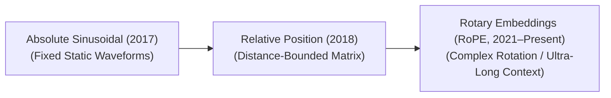

# Awesome-Positional-Encoding
## Positional Encoding: Evolution, Variants, Types, & Applications

Positional Encoding is a foundational component of the Transformer architecture. Because the core Self-Attention mechanism processes all tokens in a sequence simultaneously and in parallel, it is inherently permutation-invariant. Without positional information, a Transformer treats the sentence `"Dog bites man"` exactly the same as `"Man bites dog"`. Positional Encoding injects spatial coordinate data into the token embeddings, allowing the network to understand word order, structural distances, and sequence geometry.

---

## 1. The Chronological Evolution

The architectural progression of positional tracking reflects a shift from rigid, hardcoded coordinate curves to learnable spaces, moving toward modern relative, complex-plane rotations.

*   **The Absolute Static Era (Vaswani et al., 2017)**
    *   *Concept:* The foundation. Used fixed, deterministic sine and cosine functions of varying frequencies to generate unique coordinate vectors that are directly added to the input token embeddings.
    *   *Limitation:* Rigid and unable to extrapolate gracefully to sequence lengths longer than the maximum window defined during training.
*   **The Relative Distance Era (Shaw et al., 2018 / DeBERTa, 2020)**
    *   *Concept:* Shifted focus from absolute indices to the *relative distance* between pairs of tokens ($i - j$). It models relative offsets as trainable bias tensors inside the attention calculation matrix.
    *   *Limitation:* Introduces significant memory overhead by creating large distance lookup tables, which slows down high-throughput inference tracking.
*   **The Rotary & Multi-Scale Era (RoPE / ALiBi, ~2021–Present)**
    *   *Concept:* Formally established by **Rotary Position Embedding (RoPE)**. Instead of adding positional data, it multiplies the Query and Key vectors by a rotation matrix, encoding relative distance as a geometric angle in a complex plane.
    *   *Significance:* The standard default configuration for modern LLMs (e.g., Llama, Mistral). It naturally supports context window extrapolation via dynamic scaling methods.

---

## 2. Core Functional & Architectural Variants

Positional tracking approaches are strictly split based on whether coordinates are absolute values assigned at data entry or relative values evaluated inside attention operations.

*   **Absolute Positional Encoding**
    *   *Mechanism:* Assigns a unique, standalone position vector to each absolute index (e.g., token at index `0`, token at index `1`) before the data reaches the self-attention blocks.
    *   *Types:* Deterministic (Sinusoidal) or Learned (Parametric embedding matrices initialized randomly and trained via backpropagation).
*   **Relative Positional Encoding**
    *   *Mechanism:* Drops absolute token coordinates entirely. It computes position values purely during the attention phase by measuring how far apart tokens sit relative to each other.
    *   *Significance:* Highly intuitive for natural language, where the structural distance between a pronoun and its noun matters more than their absolute index positions in a document.

---

## 3. Advanced Context Window Extrapolation Types

As frontier applications require processing ultra-long contexts (e.g., full books or code repositories), specialized RoPE extensions modify the underlying rotational frequencies at inference time.

*   **Linear RoPE Scaling**
    *   *Mechanism:* Directly divides the incoming position indices by a constant scaling factor ($S$) to fit a long sequence into the original trained context boundaries.
    *   *Cons:* Smoothly compresses all token distances, which damages the model's high-frequency local resolution and degrades close-range attention accuracy.
*   **NTK-Aware Scaling (Neural Tangent Kernel)**
    *   *Mechanism:* Scales the base frequency of the coordinate rotation instead of scaling the position indices uniformly. It prevents high-frequency details from collapsing while expanding low-frequency ranges.
    *   *Pros:* Allows models to extrapolate context lengths out by $4\times$ to $10\times$ at inference time with minimal perplexity degradation and zero retraining.
*   **YaRN (Yet another RoPE extensioN)**
    *   *Mechanism:* An advanced variation that applies a multi-scale frequency sweep, separating out close-range token structures from long-range context dependencies.
    *   *Status:* Enables modern models to reliably process context windows exceeding 128k to 1M+ tokens without losing fine-grained accuracy.
*   **ALiBi (Attention with Linear Biases)**
    *   *Mechanism:* Drops positional embeddings entirely. Instead, it injects a static, non-learnable negative bias penalty directly into the attention matrix ($QK^T$), proportional to the absolute distance between tokens.
    *   *Pros:* Achieves exceptional zero-shot context length extrapolation, maintaining mathematical stability on infinitely long streams.

---

## 4. Cross-Domain Applications

*   **Autoregressive Multi-Turn LLM Engines**
    *   *Application:* Utilizing **RoPE** paired with **YaRN scaling** inside foundation models to maintain logical coherence, syntax layout tracking, and character memories over extended context conversations.
*   **Vision Transformers (ViT) & Image Grid Processing**
    *   *Application:* Vision networks treat image patches as sequences. Because 2D images require vertical and horizontal coordination, they implement **2D Sinusoidal Encodings** or **Conditional Positional Encodings (CPE)** to preserve spatial layouts regardless of canvas aspect ratios.
*   **Spatio-Temporal Video Architecture Generation**
    *   *Application:* Video transformers split video clips into spacetime token cubes. They deploy 3D Positional Encodings to track horizontal spatial coordinates, vertical spatial coordinates, and continuous chronological frame sequences simultaneously.

