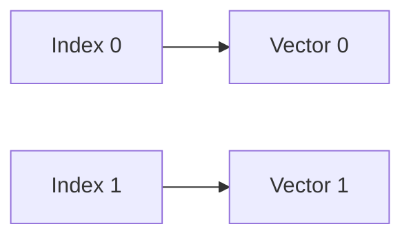

# Absolute Positional Encoding

Assigns a unique, standalone position vector to each absolute index before data reaches self-attention. It can be deterministic or learned.

[Back to Home](../README.md)