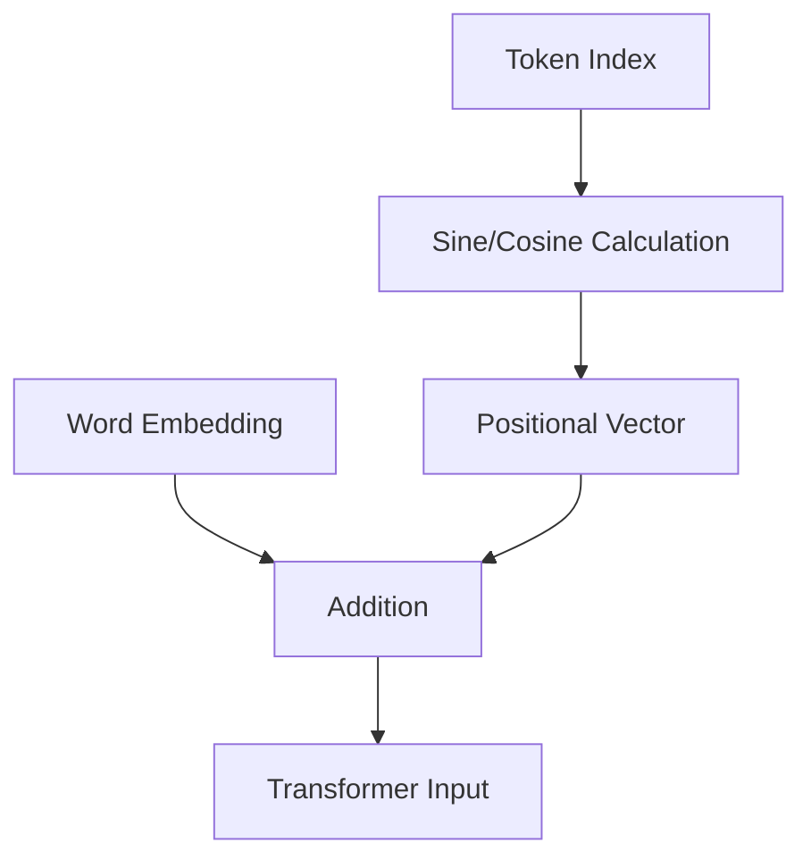

# The Absolute Static Era

This era focused on using fixed deterministic sine and cosine functions to encode positional information. These were directly added to the input token embeddings.

[Back to Home](../README.md)