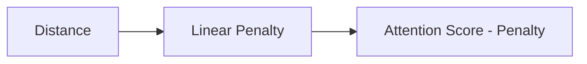

# ALiBi

Injects a static, non-learnable negative bias penalty directly into the attention matrix, proportional to the distance between tokens.

```mermaid
graph LR
    A[Distance] --> B[Linear Penalty]
    B --> C[Attention Score - Penalty]
```

[Back to Home](../README.md)