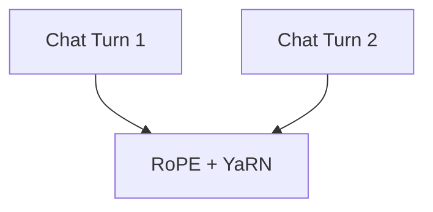

# Autoregressive Multi-Turn LLM Engines

Utilizing RoPE paired with YaRN scaling inside foundation models to maintain logical coherence over extended conversations.

```mermaid
graph TD
    A[Chat Turn 1] --> B[RoPE + YaRN]
    C[Chat Turn 2] --> B
```

[Back to Home](../README.md)