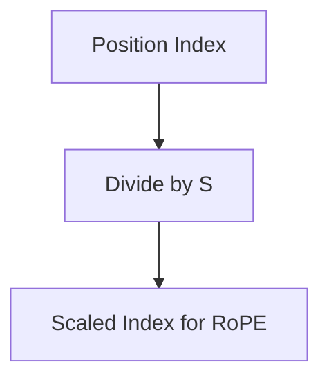

# Linear RoPE Scaling

Directly divides position indices by a constant scaling factor to fit a long sequence into original boundaries.

```mermaid
graph TD
    A[Position Index] --> B[Divide by S]
    B --> C[Scaled Index for RoPE]
```

[Back to Home](../README.md)