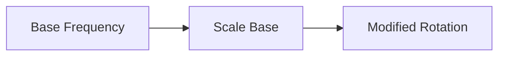

# NTK-Aware Scaling

Scales the base frequency of coordinate rotation instead of position indices uniformly to prevent high-frequency details from collapsing.

```mermaid
graph LR
    A[Base Frequency] --> B[Scale Base]
    B --> C[Modified Rotation]
```

[Back to Home](../README.md)