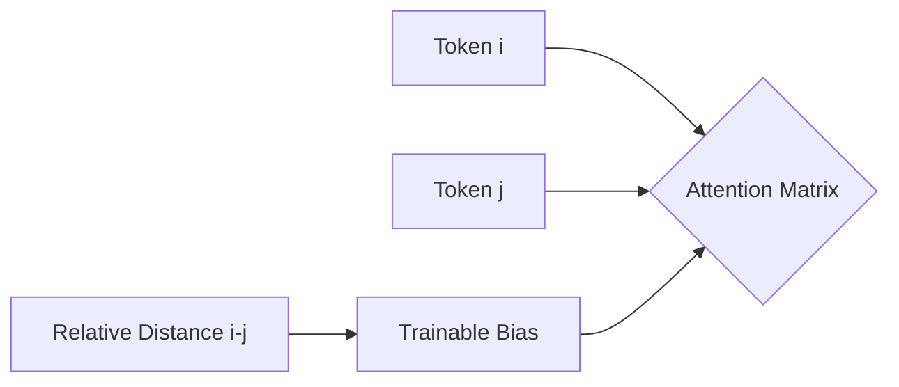

# The Relative Distance Era

Shifted focus from absolute indices to the relative distance between pairs of tokens. This approach models relative offsets as trainable bias tensors inside the attention matrix.

[Back to Home](../README.md)