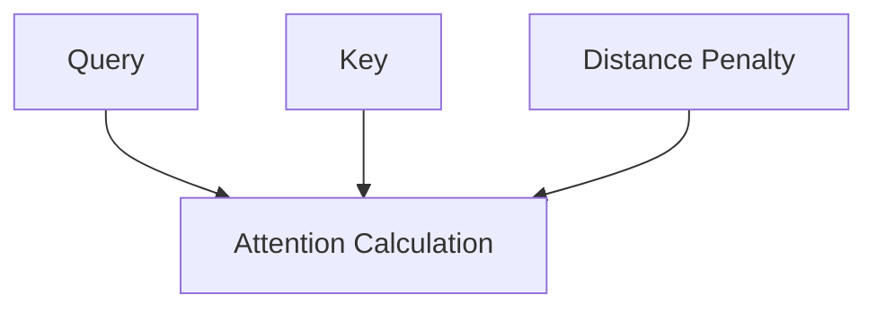

# Relative Positional Encoding

Computes position values purely during the attention phase by measuring how far apart tokens sit relative to each other.

```mermaid
graph TD
    A[Query] --> B[Attention Calculation]
    C[Key] --> B
    D[Distance Penalty] --> B
```

[Back to Home](../README.md)