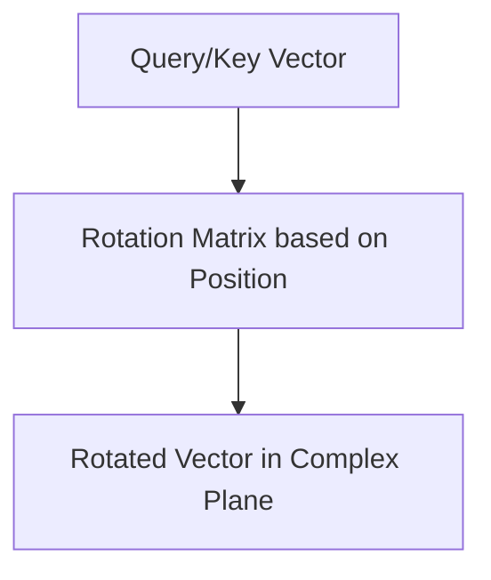

# The Rotary & Multi-Scale Era

Introduced Rotary Position Embedding (RoPE) which multiplies the Query and Key vectors by a rotation matrix, encoding relative distance as an angle in a complex plane.

[Back to Home](../README.md)