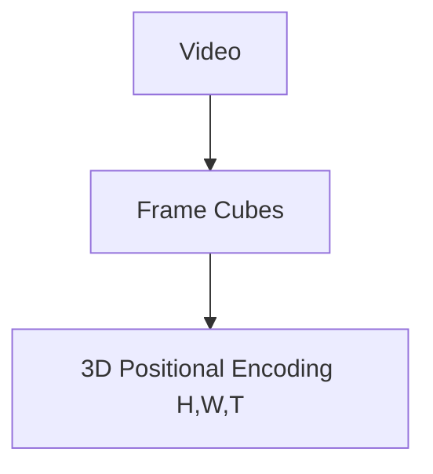

# Spatio-Temporal Video Architecture

Deploy 3D Positional Encodings to track horizontal, vertical, and chronological continuous frame sequences simultaneously.

```mermaid
graph TD
    A[Video] --> B[Frame Cubes]
    B --> C[3D Positional Encoding H,W,T]
```

[Back to Home](../README.md)