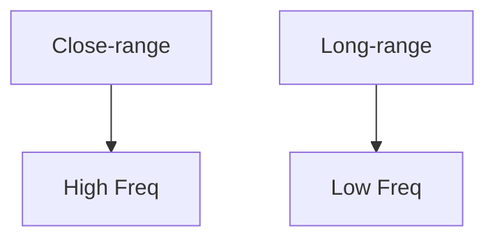

# YaRN

Applies a multi-scale frequency sweep, separating out close-range structures from long-range dependencies.

```mermaid
graph TD
    A[Close-range] --> B[High Freq]
    C[Long-range] --> D[Low Freq]
```

[Back to Home](../README.md)